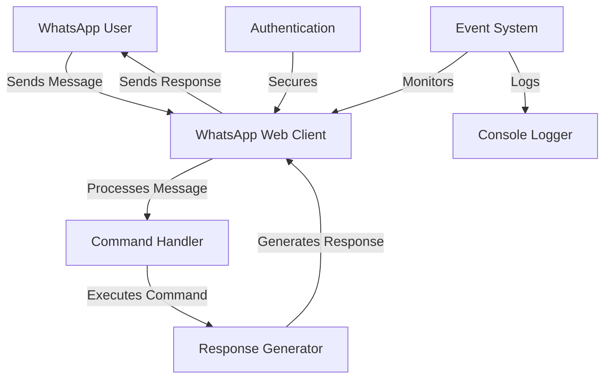

# WhatsApp AI Assistant

A WhatsApp bot that responds to commands and provides helpful responses.

## Features

- Command-based interactions
- Automatic responses to messages
- Fun commands like jokes and quotes
- Easy to extend with new commands

## Available Commands

- `!help` - Shows all available commands
- `!hello` - Get a friendly greeting
- `!time` - See the current time
- `!joke` - Get a random programming joke
- `!quote` - Get an inspirational quote

## Installation

1. Clone the repository:
```bash
git clone https://github.com/fahad0samara/whatsapp-ai-assistant.git
```

2. Install dependencies:
```bash
cd whatsapp-ai-assistant
npm install
```

3. Start the application:
```bash
npm start
```

4. Scan the QR code with WhatsApp to connect

## Requirements

- Node.js v14 or higher
- A WhatsApp account
- Internet connection

## Contributing

Feel free to open issues and pull requests!

## License

MIT License

# 🤖 WhatsApp AI Assistant

A powerful WhatsApp bot that responds to commands and provides helpful responses.

## ✨ Features

- 📱 Command-based interactions
- 🤖 Automatic responses to messages
- 😄 Fun commands like jokes and quotes
- 🔧 Easy to extend with new commands
- ⚡ Real-time message processing
- 🔒 Secure authentication
- 📝 Detailed logging

## 🎯 Available Commands

- `!help` - Shows all available commands
- `!hello` - Get a friendly greeting
- `!time` - See the current time
- `!joke` - Get a random programming joke
- `!quote` - Get an inspirational quote

## 🏗 Architecture



## 🛠 Technical Stack

- **Runtime**: Node.js
- **WhatsApp Client**: whatsapp-web.js
- **QR Code**: qrcode-terminal
- **Browser Automation**: Puppeteer
- **Authentication**: Local Auth Strategy

## 🚀 Installation

1. Clone the repository:
```bash
git clone https://github.com/fahad0samara/whatsapp-ai-assistant.git
```

2. Install dependencies:
```bash
cd whatsapp-ai-assistant
npm install
```

3. Start the application:
```bash
npm start
```

4. Scan the QR code with WhatsApp to connect

## 📋 Requirements

- Node.js v14 or higher
- A WhatsApp account
- Internet connection
- Chrome/Chromium browser

## 🔧 Configuration

The bot can be configured through various settings:
- Message handling preferences
- Command prefixes
- Response templates
- Logging levels

## 🔒 Security Features

- End-to-end encryption (provided by WhatsApp)
- Local authentication
- No message storage
- Secure session management

## 🤝 Contributing

We welcome contributions! Here's how you can help:

1. Fork the repository
2. Create your feature branch (`git checkout -b feature/AmazingFeature`)
3. Commit your changes (`git commit -m 'Add some AmazingFeature'`)
4. Push to the branch (`git push origin feature/AmazingFeature`)
5. Open a Pull Request

## 📝 License

This project is licensed under the MIT License - see the [LICENSE](LICENSE) file for details.

## 📬 Contact

- GitHub: [@fahad0samara](https://github.com/fahad0samara)
- Project Link: [https://github.com/fahad0samara/whatsapp-ai-assistant](https://github.com/fahad0samara/whatsapp-ai-assistant)

## 🙏 Acknowledgments

- WhatsApp Web API
- Node.js community
- All contributors

---
⭐ Star this repository if you find it helpful!
